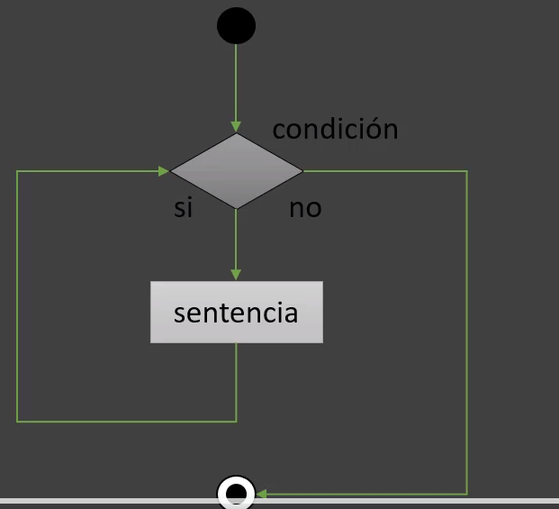
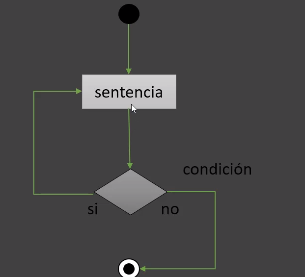
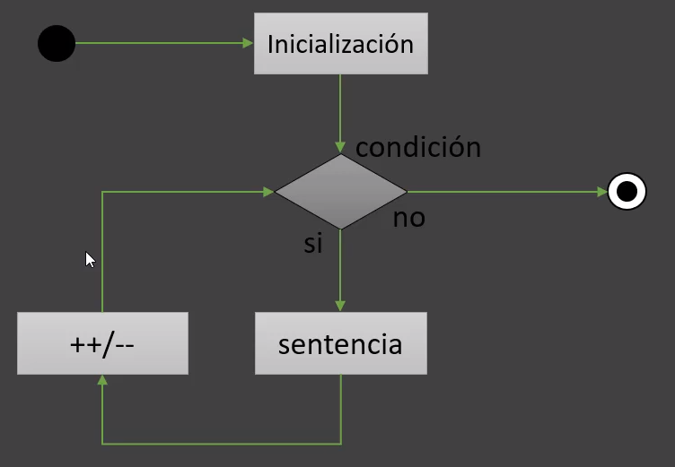

# Flujos  del controls 

  # if-else
    
 -  ejecuta un bloque de codigo 

 - ```java
   if(expresion){ 
        //ejecuta un bloque de cofigo
   }
    ```
# if-else

 - Si la expresión es falsa hacer uso de else


 ```java
    if(expresion){
    //ejecuta el bloque de código se cumple la condición
    }else{
     //setnecia a ejecutar si no se cumple la condición
    }
```    
    
 - O bien, una serie de comparaciones else if y una sentencia else
  
```java
    if(expresion){
    //bloque a ejecutar si cumple la primera condición
    }else if(expresion){
      //sentnecia a ejecutar si cumple segunda condicón
    }else{
      //sentencia a ejecutar si No cumple ninguna condición
    }
  ```    

# Setencia swith case

 - La sentencia swith o interruptor se utiliza para realizar sentnecias condicionalmente 
   basadas en alguna expresión
 - Deacuerdo al valor de la expresión se ejecuta la sentencia case apropiada

 - La sentencia break hace que el control salga de la sentencia switch continúe con la siguiente
   linea
```java
   //switch solo permite tipo de variables primitvo como int,byte,char y String pero eso a partir de la version 7 de java o enum enumerador de java
    switch(varaible){
    case valor1;
    // ejecuta sentencia 1
    break;    
    case valor2;
    // ejecuta sentencia 2
    break;    
    case valor3;
    // ejecuta sentencia 3
     break;    
    default:
        // Si no existe coincidencia. se ejecuta la sentnecia default

        }
  ```    
  # Separadores 
 
- Existen otros caracteres en java con siginificado escpecial, son los sepradores:
------------------------------------------------------------------------------------

# Sentencia Bucle

      - Setentecia **while**
         Ejecuta un bloque de código mientras se cumpla la condición 



# Sentencia while

      - Es una estructura de iteración precondición, primero evalúa la expresión 
        antes de ejecutar cualquier sentencia 

         code
```java
   
while(expresion){
    
//ejecuta cualquier setencia de código mientras se cumpla la condición    
}
```

      - Sentencia
         do while
      Similar al while, excepto en que la expresión se evalua al final del bucl, se 
      ejecuta almenos una ez



```java
   
do{
   //ejecuata el bloque al menos una vez    
}while(expresion);
```

      - Setencia for
      La setencia for se utiliza cuando se conocen los límimites del bucle


      - la setencia for se utiliza cuando se coonocen los límites de bucle
         (inicialización, su condición de término y su instrucción de incremento/decremento)
```java
//  i = 0         ; i <10 ;   i++   
fo(inicialización ;condición; incremento){
        //el bloque de codigo se ejecuta si se cumple la condicioón
        }
```
      