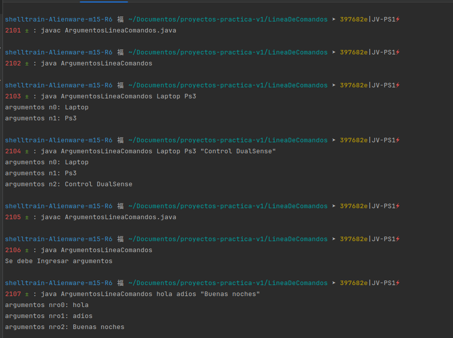
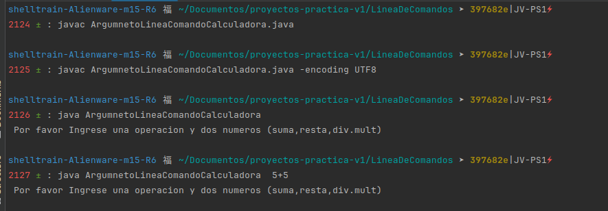
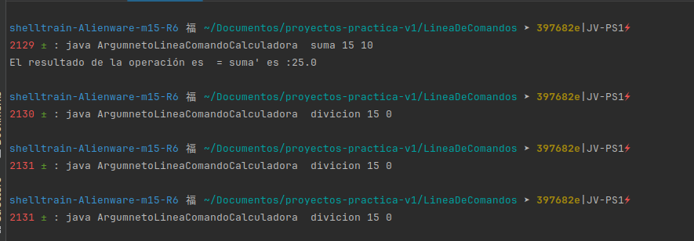
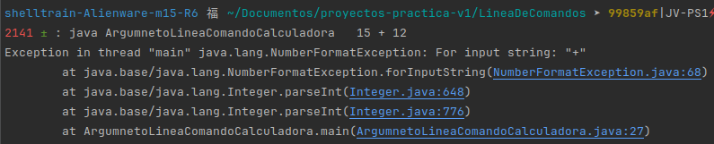
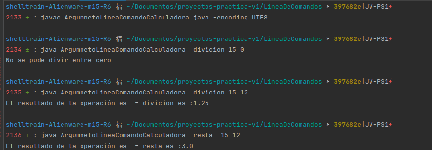
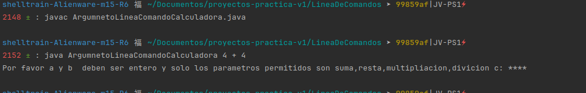
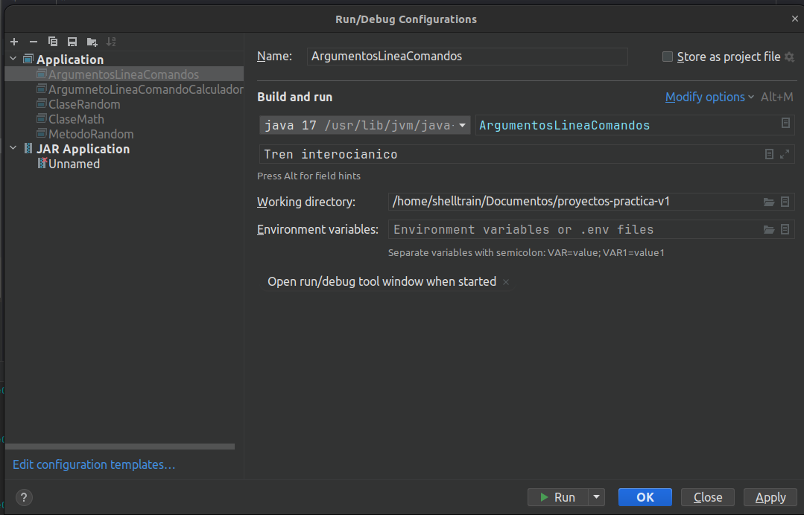
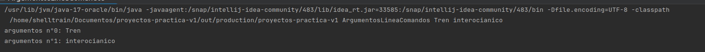
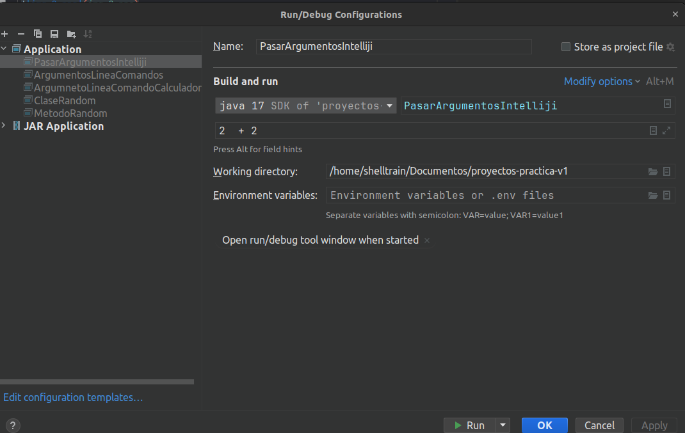
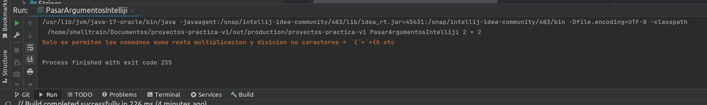

# Esta es una pequeña demstracion del funcionamiento Bytecode manual usando el terminal 

    Demostración linea de comados ejecuatdos con java compiler de manera manual

    Demostración usando el ejercicio de la calculadora parametros 
    

    Importante agrgar la NumberFormatException para prevenir un caracter especial o algun parametro que no hayamos definido

     Demostración en el ide configuración 

    Salida de consola en el Ide

    Se agraga try Catch pera el control de ejecuciones

