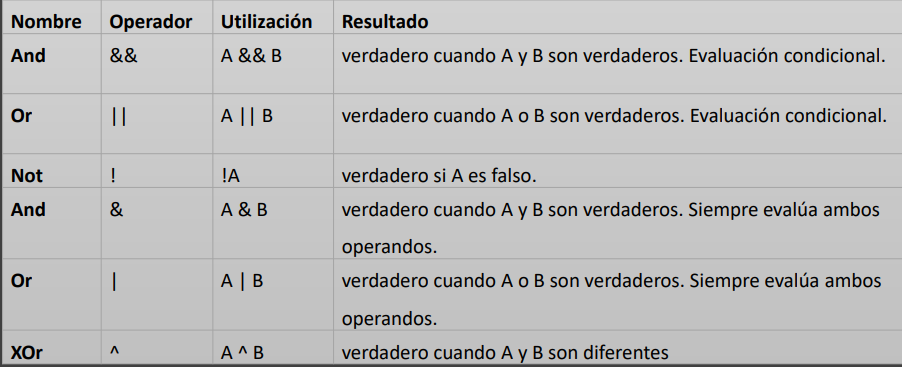

# Qué son los opredadores

Java proporciona muchos tipos de operadores que se pueden usar según la necesidad.
Se clacifican según la funcionalidad qeu brindan

Sriven para realizar cálculos matemáticos, comparar valores, para unir
identificadores y literales, para formar expresiones lógica, toma de desiciones etc

aritmetpico     relacionales      lógicos     asignación

unarios,incrementales, ternarios, combinados, de bit , de instancia

#     Operadores

- Se utilian para realizar operaciones aritmeticas simples  en tipo de datos primiticos

#   Operadores Combinados

- Operadores combinados o compuestos; -=, +=, /=,*=etc
    - a += 5 es equivalente: a  = a + 5;

      int a = 3;
      a + =5;

- a/=b es quivalente a a= a /b;

# Operador Incremento & Decremento

- Utilizado para incrementar o decrementar el valor en 1
    - Hay dos variedades de operadores de incremento pre y post

      Ejemplo   Nombre            Efecto

      ++a     Pre-incremento    Incremento a en uno, y luego devuelve a.
      a++     Post-incremento   Devuelve a, y luego incrementa a en uno
      --a     Pre-decremento    Decremento a uno, y luego devuelve a.
      a--     post-decremente   Devuelve a , y luego decrementa a en uno
    
    int a = 1;
    // En este primer caso, a validar 2 y b también
    int b = a++;
    // Ahora, a sigue valiendo 2, pero b es ahora 1
    b = a++;
  
  - Se pueden colocar tanto antes como después la expresión que deseemos 
    modificar pero sólo devuelven el valor modificado si están  delante.

# operador ternario o condicional

 - El operador ternario es una versión abreviada de la sentencia if-else.
 - Tiene tres operandos y de ahi el nombre ternario:

   (condición)?valor1:valor2
 
 - Si la condición se cumple devuelve el primer valor y, en caso contrario, el segundo.
 - El siguiente ejemplo asignara la variable 'a' un 2
 - 
    
    int a = 2 > 3 ?1:2;

# Operadores Relacionales

 - Se Utilizan para comprobar relaiones de igualdad, mayor que, menor que.
 - Devuelven un resultado boobleano después de la comparación, ture si la 
   comparación fue exitosa y false en caso contrario
 - Se usan ampliamente en las sentencias if/else, asi como en bucles
    
   

# Operadores Lógicos

   - Los operadores lógicos permiten evaluar expresiones lógicos y trabajan
     con operadores booleanos
     - Realizan las operaciones lógicas de conjunción(AND), disyunción (QR) y negación(NOT)

       

# Tabla de vardad  operadores lógicos

   

#  precedencia de los operadores 

   
        
    
