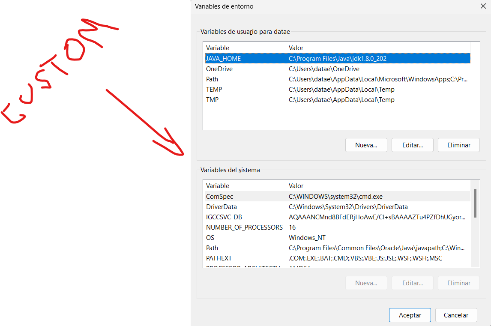
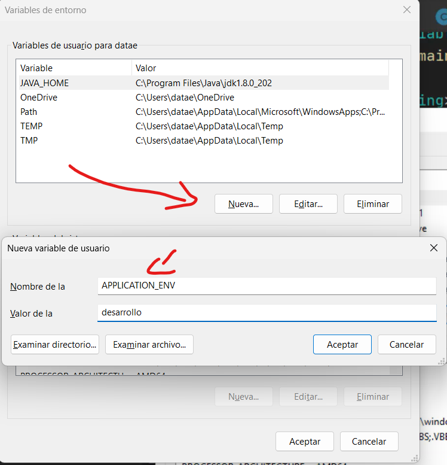
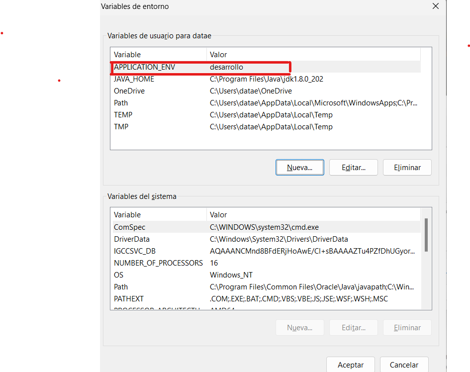
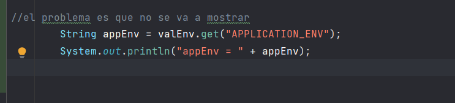
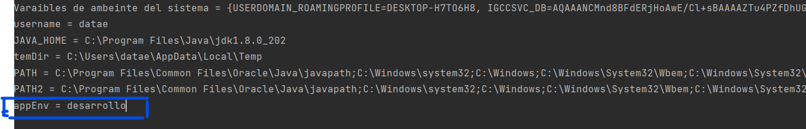
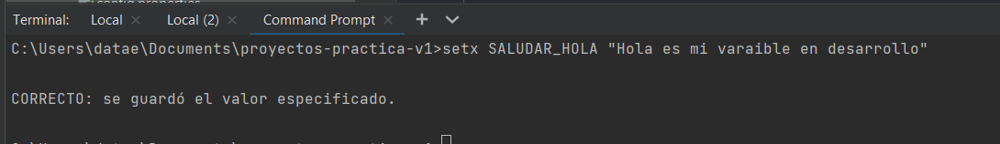
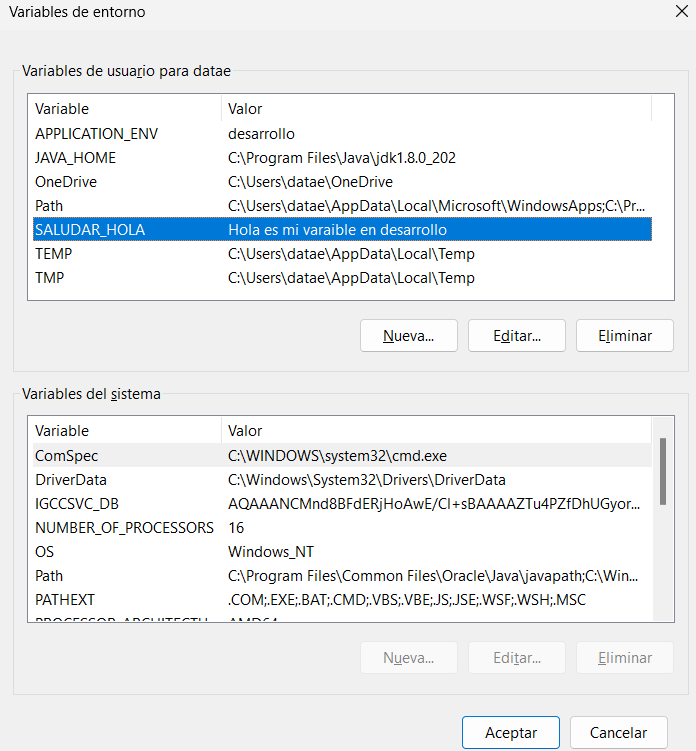

# Demostracion de varaibles de entrno java usando windows

# creamos una nueva varaible de entorno 

# una vez  creada la variable de entorno

# una vez creada 

# el problema es que no se va a mostrar

# reniciar el id no lo muestra 

# una vez reiniciado lo debe mostrar

# Creando nuestra propia varaible de entorno

 Desmostracion grafica

